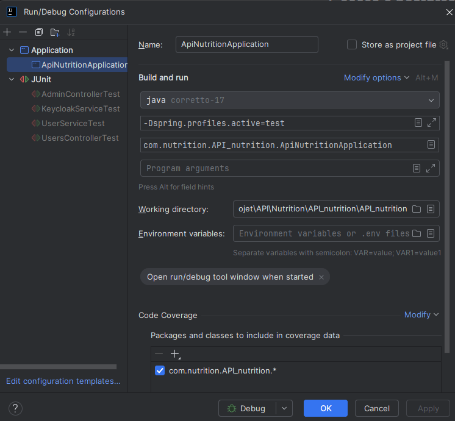
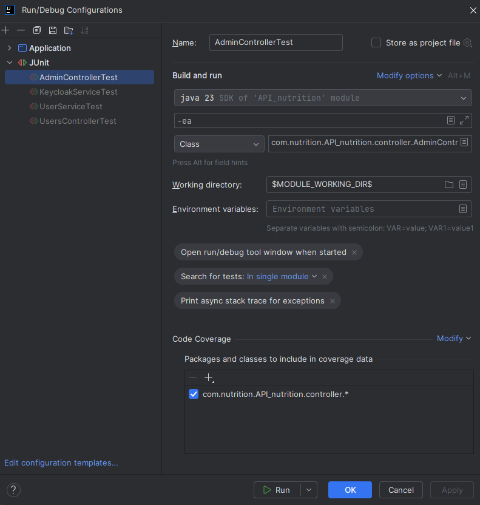

# API Spring Keycloak

User Management API with Profile Extension and Keycloak Integration
This project is a secure RESTful API built with Spring Boot, designed to handle user account registration, role
administration through Keycloak, and the extension of custom business data per user.

⚙️ Core Features

1. User Management (UsersController)
    * Registers users in Keycloak, which handles identity and authentication.
    * Upon registration, custom business-related data is created and stored in the API's own database, associated with
      the user’s unique ID from the Keycloak token.
    * No personal identity data (name, email, password) is stored in the API; these are managed entirely within
      Keycloak.
    * The user’s Keycloak ID (sub from the JWT token) is used to link and manipulate business-related data.

2. Administration Tools (AdminController)
    * Allows administrators to retrieve and manage user roles at the realm or client level within Keycloak.
    * Provides endpoints to assign/remove roles, enable/disable user accounts, and trigger password resets.
    * Authorization is enforced using roles extracted from the JWT token issued by Keycloak.

🔒 Security Model
Authentication is managed by Keycloak, and all endpoints are protected by role-based access control
(ROLE_USER_REALM, ROLE_ADMIN_REALM).
The JWT token is used both for authorization and to resolve the identity of the business data owner.

### Sommaire

* [Run projet](#run-projet)
* [Run test](#run-test)
* [Intellij Config](#intellij-config)
* [Security Configuration](#security-configuration)
* [Endpoints Main ](#endpoints-main)
    * [User management](#user-management)
    * [Administration](#administration)
* [Codes de Réponse HTTP](#codes-de-réponse-http)
* [Docker](#docker)
    * [Useful commands](#useful-commands)
    * [kubernetes](#kubernetes)
        * [Development Script ](#development-script)
        * [kubernetes configuration](#kubernetes-configuration)
        * [kubernetes](#kubernetes-deployment-in-the-minikube-cluster)
* [Maven Wrapper: How It Works](#maven-wrapper-how-it-works)
    * [What is Maven Wrapper?](#what-is-maven-wrapper)
    * [How it works](#how-it-works)
    * [Benefits](#benefits)
    * [Common Usage](#common-usage)

## Run projet

Launch of Spring without profile

* Linux :

````shell
./mvnw spring-boot:run -Dspring-boot.run.profiles=test
````

* Windows :

````bash
./mvnw spring-boot:run -D spring-boot.run.profiles=test
````

## Run test

Launching unit tests with profile.

* Linux :

````shell
./mvnw clean test -Dspring.profiles.active=test
````

* Windows :

````bash
./mvnw clean test -D spring.profiles.active=test
````

Access browser:

* [Database H2 Access IP](http://localhost:8080/h2-console)
* [Doc Swagger IP](http://localhost:8080/swagger-ui/index.html)

Database H2 password: ``password``

## Intellij Config

Here is the configuration required to launch the project in the Intellij IDE



Here is an example of the configuration required to launch a test in the Intellij IDE



## Security Configuration

Security is managed through the `SecurityConfig` class, with the following features:

- **CSRF Disabled**: Since the API is stateless.
- **JWT Configuration**: Roles are extracted from Keycloak tokens.
- **Authorization Rules**:
    - Public access is allowed for authentication and documentation endpoints.
    - Access to `/api/v1/admin/**` is restricted to users with the `ROLE_ADMIN` authority.
    - Authentication is required for all other endpoints.

## Endpoints Main

### User management

* class: UsersController

| Endpoint               | Méthode | Description   | Rôle Requis | Codes Réponse                     |
|------------------------|---------|---------------|-------------|-----------------------------------|
| /api/v1/users/register | POST    | User creation | ROLE_BASIC  | 201, 400, 401, 403, 409, 500      |
| /api/v1/users/user     | PUT     | User update   | ROLE_BASIC  | 200, 400, 401, 403, 404, 500      |
| /api/v1/users/{id}     | DELETE  | User deletion | ROLE_BASIC  | 204, 400, 401, 403, 404, 409, 500 |
| /api/v1/users/{id}     | GET     | User recovery | ROLE_BASIC  | 200, 400, 401, 403, 404, 500      |

📝 Description:
This controller manages the business data associated with a user.
It can only be accessed after authentication via Keycloak, guaranteeing secure operations. It can be used to add,
modify, delete and view data linked to the logged-in user. Each action is protected by appropriate role-based access
control (`ROLE_BASIC`).

### Administration

* class: AdminController

| Endpoint                                                | Méthode | Description                                                 | Rôle Requis      | Codes Réponse                |
|---------------------------------------------------------|---------|-------------------------------------------------------------|------------------|------------------------------|
| /api/v1/admin/users                                     | GET     | Lists all users registered in the Keycloak realm.           | ROLE_ADMIN_FRONT | 200, 401, 403,  500          |
| /api/v1/admin/roles/realm                               | GET     | List of client roles on configured domains                  | ROLE_ADMIN_FRONT | 200, 401, 403,  500          |
| /api/v1/admin/roles/client/{targetClient}               | GET     | list of any client roles configured on the targeted domains | ROLE_ADMIN_FRONT | 204, 400, 401, 403, 404, 500 |
| /api/v1/admin/user/{userId}/{targetClient}              | GET     | list of user roles on the targeted client                   | ROLE_ADMIN_FRONT | 204, 400, 401, 403, 404, 500 |
| /api/v1/admin/user/{userId}/roles/client/{targetClient} | POST    | Add roles to user on the targeted client                    | ROLE_ADMIN_FRONT | 204, 400, 401, 403, 404, 500 |
| /api/v1/admin/user/{userId}/roles/client/{targetClient} | DELETE  | Removal of the user's role on the targeted client           | ROLE_ADMIN_FRONT | 204, 400, 401, 403, 404, 500 |
| /api/v1/admin/users/{userId}/roles/realm                | POST    | Add role to user on targeted domain                         | ROLE_ADMIN_FRONT | 204, 400, 401, 403, 404, 500 |
| /api/v1/admin/users/{userId}/roles/realm                | DELETE  | removal of the user's role on the targeted domain           | ROLE_ADMIN_FRONT | 204, 400, 401, 403, 404, 500 |

📝 Description:

This controller provides administrative tools for managing user roles in Keycloak. Each action is protected by
appropriate role-based access control (`ROLE_ADMIN_FRONT`).

## Codes de Réponse HTTP

The API uses the following standard HTTP status codes:

| Code | Description                                                                      |
|------|----------------------------------------------------------------------------------|
| 200  | **OK** - The request was successful                                              |
| 201  | **Created** - Successfully created resource                                      |
| 204  | **No Content** - Request processed successfully but no content to return         |
| 400  | **Bad Request** - The request contains errors or invalid data                    |
| 401  | **Unauthorized** - Authentication required or authentication failed              |
| 404  | **Not Found** - The requested resource does not exist                            |
| 409  | **Conflict** - The request cannot be processed due to a conflict (ex: duplicate) |
| 500  | **Internal Server Error** - Unexpected server-side error                         |

## Docker

### Useful commands

Below are example commands to build and run the Docker image of the project in a `PowerShell` or similar terminal.

````shell
docker build -t api-nutrition:latest .

# Display logs in the launch terminal
docker run --name api-nutrition -p 8080:8080 -e SPRING_PROFILES_ACTIVE=test api-nutrition:latest

# detach mode
docker run -d --name api-nutrition -p 8080:8080 -e SPRING_PROFILES_ACTIVE=test api-nutrition:latest
````

Container Management Commands

````shell
# View container logs in real-time
docker logs -f api-nutrition

# Start an existing container
docker start api-nutrition

# Stop and remove a container
docker stop api-nutrition && docker rm api-nutrition

# Remove Docker images
docker rmi api-nutrition:latest
docker rmi ghmaxime88/api-nutrition:latest
````

Push to a Docker Repository

1. Log in to Docker Hub

````shell
docker login
````

2. Tag the Image

````shell
# Format: docker tag <local-image:tag> <username>/<repository:tag>
docker tag api-nutrition:latest ghmaxime88/api-nutrition:latest
````

3. Push the Image to the Repository

````shell
docker push ghmaxime88/api-nutrition:latest
````

4. Pull the Image from the Repository

````shell
docker pull ghmaxime88/api-nutrition:latest
````

### Kubernetes

#### Development script

After configuring the Kubernetes client and your Minikube cluster, you can use the following `PowerShell` scripts:

| Fichier                  | Rôle                                                                                                             |
|--------------------------|------------------------------------------------------------------------------------------------------------------|
| `buil_docker.ps1`        | Creates a docker image, opens a connection to my repository after creating the docker image and executes a push. |
| `cleanup_k8s_docker.ps1` | Cleans up the cluster by freeing up Kubernetes resources and deleting docker images                              |
| `deploy_k8s.ps1`         | Allows you to deploy a docker image in the Minikube cluster                                                      |

#### Kubernetes configuration

For this project, I'm using Hyper-V to deploy a Minikube VM. After installing this VM, you can use the Kubernetes file
which is currently in the k8s folder. Before you start, you need to check that your Kubernetes client is properly
configured to your cluster, in this case Minikube if you have installed it. If your client returns docker-desktop, this
means that your client is connected to this context

````shell
# check Cluster context 
kubectl config current-context

# check status 
kubectl get nodes
````

Some commands for managing the Minikube cluster

````shell
minikube status
minikube start
minikube stop
````

To get the URL of the api-nutrition service in the Minikube cluster

````shell
minikube service api-nutrition --url
````

Local configuration of access to the nutrition API in the cluster.
Ajoutez `nutrition.local` dans votre `/etc/hosts` :

```shell
[Minikube IP] nutrition.local
```

#### Kubernetes deployment in the Minikube cluster

This section describes how to deploy, manage and remove the `api-nutrition` application on a Kubernetes cluster. The
configuration files can be found in the `./k8s/` folder. Make sure you have `kubectl` configured and access to cluster
before running the commands below.

**deploy the application**

````shell
# Lancement
kubectl apply -f ./k8s/deployment.yaml
kubectl apply -f ./k8s/service.yaml
kubectl apply -f ./k8s/ingress.yaml
````

**Deleting the application**

```shell
# L'arrête
kubectl delete -f ./k8s/deployment.yaml
kubectl delete -f ./k8s/service.yaml
kubectl delete ingress api-nutrition-ingress
```

**Additional controls**  
Test the application locally via a port-forward :

````shell
kubectl port-forward svc/api-nutrition 8077:8080
````

* Local port: 8077 (the port on your local machine where you will access the service).
* Target port: 8080 (the port of the api-nutrition service in the cluster, as defined in your Service file with
  port: 8080).
* Result: You will be able to access the application locally via http://localhost:8077, and traffic will be redirected
  to the service's port 8080, which relays to the pods' port 8080.

**Configuring the Ingress Controller**  
To redirect requests to via ingress, you need to create the domain redirection to your IP cluster in your host file.

````shell
kubectl get ingress
````

**Configuring cluster access**  
To configure RBAC (Role-Based Access Control) authorizations :

````shell
kubectl apply -f ./k8s/rbac.yaml
````

**Status check**  
To check the status of services and pods :

````shell
# List all resources (pods, services, etc.)
kubectl get all

# List pods
kubectl get pods

# Displays details of a specific pod
kubectl describe pod <nom-du-pod>

# Checks service status
kubectl get services api-nutrition

# Checks that the service is associated with a pod
kubectl get endpoints api-nutrition
````

For more details on a specific pod :

````shell
kubectl describe pod <nom-du-pod>
````

**Checking the Ingress Controller**
To check that the Ingress Controller is operational :

````shell
kubectl get pods -n ingress-nginx
````

**Consultation des logs**
To display the application logs :

````shell
# Display logs for all pods with label app=api-nutrition
kubectl logs -l app=api-nutrition

# Tracks logs in real time for a specific pod
kubectl logs -f <nom-du-pod>
````

```shell
# Check that the service exists
kubectl get svc api-nutrition

# Also check that the service is associated with a pod
kubectl get endpoints api-nutrition
```

### K8s

📂 Arborescence actuelle du dossier k8s/
.  
├── deployment.yaml   
├── ingress.yaml   
├── rbac.yaml   
└── service.yaml

Existing files and their usefulness:

| Fichier            | Rôle                                                                                        |
|--------------------|---------------------------------------------------------------------------------------------|
| `deployment.yaml`  | Defines how to deploy your container in a pod: image, ports, volumes, etc.                  |
| `ingress.yaml`     | Exposes your service via a domain name (e.g., api.local), ideal for browser access.         |
| `rbac.yaml`        | Configures Role-Based Access Control (RBAC) permissions for the application in the cluster. |
| `service-api.yaml` | Makes your pod accessible within the cluster (e.g., via ClusterIP, NodePort, etc.).         |

## Maven Wrapper: How It Works

### What is Maven Wrapper?

Maven Wrapper (`mvnw`) is a script that allows you to run Maven commands without having Maven installed on your system.

## How it works

When you execute the `./mvnw` command (or `mvnw.cmd` on Windows):

1. The Maven Wrapper script checks if Maven is already available in a local directory of the project (typically
   `.mvn/wrapper/`)

2. If Maven is not found locally, the script automatically downloads the appropriate version of Maven specified in your
   project

3. Then, the script executes the Maven command you requested using this downloaded version

## What about JDK?

* The Maven Wrapper downloads Maven, but not the JDK
* A JDK is still necessary to compile and run Java code
* If you don't have a JDK installed, you'll get an error like "JAVA_HOME is not set" or "java command not found"

## Benefits

* Ensures everyone on the team uses the same Maven version
* No need to install Maven globally on your machine
* Makes project setup easier for new developers
* Perfect for CI/CD pipelines where you want to control the Maven version

## Common Usage

```bash
# Linux/Mac
./mvnw clean install

# Windows
mvnw.cmd clean install
```

In a Spring development environment, you'll still need to install a JDK, but not necessarily Maven thanks to the
wrapper.
