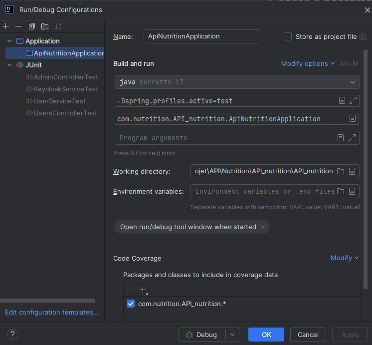
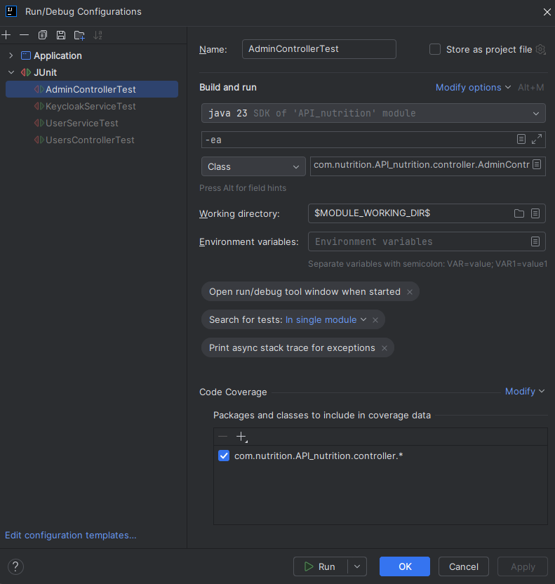

# API Spring Keycloak

API de gestion des utilisateurs avec extension de profil et intégration Keycloak  
Ce projet est une API RESTful sécurisée développée avec Spring Boot, conçue pour gérer l’enregistrement des comptes
utilisateurs,
l’administration des rôles via Keycloak et l’extension de données métier personnalisées pour chaque utilisateur.

---

## ⚙️ Fonctionnalités principales

### 1. Gestion des utilisateurs (UsersController)

* Enregistre les utilisateurs dans Keycloak, qui gère l’identité et l’authentification.
* Lors de l’inscription, des données métier personnalisées sont créées et stockées dans la base de données de l’API,
  associées à l’ID unique de l’utilisateur provenant du jeton Keycloak.
* Aucune donnée d’identité personnelle (nom, e‑mail, mot de passe) n’est stockée dans l’API ; ces informations sont
  entièrement gérées par Keycloak.
* L’ID Keycloak de l’utilisateur (`sub` du jeton JWT) est utilisé pour lier et manipuler les données métier
  correspondantes.

### 2. Outils d’administration (AdminController)

* Permet aux administrateurs de consulter et gérer les rôles des utilisateurs au niveau du *realm* ou du client dans
  Keycloak.
* Fournit des endpoints pour attribuer/supprimer des rôles, activer/désactiver des comptes et déclencher une
  réinitialisation de mot de passe.
* L’autorisation est appliquée via les rôles extraits du jeton JWT émis par Keycloak.

---

## 🔒 Modèle de sécurité

L’authentification est gérée par Keycloak et tous les endpoints sont protégés par un contrôle d’accès basé sur les
rôles (`ROLE_USER_REALM`, `ROLE_ADMIN_REALM`).  
Le jeton JWT est utilisé à la fois pour l’autorisation et pour identifier le propriétaire des données métier.

---

## Sommaire

* [Exécution du projet](#exécution-du-projet)
* [Exécution des tests](#exécution-des-tests)
* [Configuration IntelliJ](#configuration-intellij)
* [Configuration de la sécurité](#configuration-de-la-sécurité)
* [Endpoints principaux](#endpoints-principaux)
    * [Gestion des utilisateurs](#gestion-des-utilisateurs)
    * [Administration](#administration)
* [Codes de réponse HTTP](#codes-de-réponse-http)
* [Docker](#docker)
    * [Commandes utiles](#commandes-utiles)
    * [Kubernetes](#kubernetes)
        * [Script de développement](#script-de-développement)
        * [Configuration Kubernetes](#configuration-kubernetes)
        * [Déploiement dans le cluster Minikube](#déploiement-dans-le-cluster-minikube)
* [Maven Wrapper : fonctionnement](#maven-wrapper-fonctionnement)
    * [Qu’est-ce que Maven Wrapper ?](#quest-ce-que-maven-wrapper)
    * [Fonctionnement](#fonctionnement)
    * [Avantages](#avantages)
    * [Utilisation courante](#utilisation-courante)

---

## Exécution du projet

Lancement de Spring sans profil

### Linux

```shell
./mvnw spring-boot:run -Dspring-boot.run.profiles=test
```

### Windows

```bash
./mvnw spring-boot:run -D spring-boot.run.profiles=test
```

---

## Exécution des tests

Lancement des tests unitaires avec profil actif.

### Linux

```shell
./mvnw clean test -Dspring.profiles.active=test
```

### Windows

```bash
./mvnw clean test -D spring.profiles.active=test
```

Accès navigateur:

* [Accès base H2](http://localhost:8080/h2-console)
* [Documentation Swagger](http://localhost:8080/swagger-ui/index.html)

Mot de passe H2: `password`

---

## Configuration IntelliJ

Voici la configuration requise pour exécuter le projet dans l’IDE IntelliJ:



Exemple de configuration pour exécuter un test dans IntelliJ:



---

## Configuration de la sécurité

La sécurité est gérée via la classe `SecurityConfig` avec les caractéristiques suivantes:

* **CSRF désactivé**: l’API est sans état (*stateless*).
* **Configuration JWT**: les rôles sont extraits des jetons Keycloak.
* **Règles d’autorisation**:
    * Accès public pour les endpoints d’authentification et de documentation.
    * Accès à `/api/v1/admin/**` restreint aux utilisateurs avec l’autorité `ROLE_ADMIN`.
    * Authentification obligatoire pour tous les autres endpoints.

---

## Endpoints principaux

### Gestion des utilisateurs

*Classe:* `UsersController`

| Endpoint                 | Méthode | Description              | Rôle requis | Codes de réponse                  |
|--------------------------|---------|--------------------------|-------------|-----------------------------------|
| `/api/v1/users/register` | POST    | Création d’utilisateur   | ROLE_BASIC  | 201, 400, 401, 403, 409, 500      |
| `/api/v1/users/user`     | PUT     | Mise à jour utilisateur  | ROLE_BASIC  | 200, 400, 401, 403, 404, 500      |
| `/api/v1/users/{id}`     | DELETE  | Suppression utilisateur  | ROLE_BASIC  | 204, 400, 401, 403, 404, 409, 500 |
| `/api/v1/users/{id}`     | GET     | Récupération utilisateur | ROLE_BASIC  | 200, 400, 401, 403, 404, 500      |

📝 **Description:**  
Ce contrôleur gère les données métier associées à un utilisateur.  
Il n’est accessible qu’après authentification via Keycloak, garantissant des opérations sécurisées.  
Il permet d’ajouter, modifier, supprimer et consulter les données liées à l’utilisateur connecté.  
Chaque action est protégée par un contrôle d’accès basé sur les rôles (`ROLE_BASIC`).

---

### Administration

*Classe:* `AdminController`

| Endpoint                                                  | Méthode | Description                                               | Rôle requis      | Codes de réponse             |
|-----------------------------------------------------------|---------|-----------------------------------------------------------|------------------|------------------------------|
| `/api/v1/admin/users`                                     | GET     | Liste des utilisateurs enregistrés dans le realm Keycloak | ROLE_ADMIN_FRONT | 200, 401, 403, 500           |
| `/api/v1/admin/roles/realm`                               | GET     | Liste des rôles de domaine configurés                     | ROLE_ADMIN_FRONT | 200, 401, 403, 500           |
| `/api/v1/admin/roles/client/{targetClient}`               | GET     | Liste des rôles client sur un domaine ciblé               | ROLE_ADMIN_FRONT | 204, 400, 401, 403, 404, 500 |
| `/api/v1/admin/user/{userId}/{targetClient}`              | GET     | Liste des rôles d’un utilisateur sur un client            | ROLE_ADMIN_FRONT | 204, 400, 401, 403, 404, 500 |
| `/api/v1/admin/user/{userId}/roles/client/{targetClient}` | POST    | Ajout de rôles à un utilisateur sur un client             | ROLE_ADMIN_FRONT | 204, 400, 401, 403, 404, 500 |
| `/api/v1/admin/user/{userId}/roles/client/{targetClient}` | DELETE  | Suppression du rôle utilisateur sur un client             | ROLE_ADMIN_FRONT | 204, 400, 401, 403, 404, 500 |
| `/api/v1/admin/users/{userId}/roles/realm`                | POST    | Ajout d’un rôle sur un domaine                            | ROLE_ADMIN_FRONT | 204, 400, 401, 403, 404, 500 |
| `/api/v1/admin/users/{userId}/roles/realm`                | DELETE  | Suppression d’un rôle sur un domaine                      | ROLE_ADMIN_FRONT | 204, 400, 401, 403, 404, 500 |

📝 **Description:**  
Ce contrôleur fournit les outils d’administration pour la gestion des rôles utilisateurs dans Keycloak.  
Chaque action est protégée par un contrôle d’accès basé sur les rôles (`ROLE_ADMIN_FRONT`).

---

## Codes de réponse HTTP

| Code | Description                                                    |
|------|----------------------------------------------------------------|
| 200  | ✅ **OK** – Requête réussie                                     |
| 201  | 🆕 **Created** – Ressource créée avec succès                   |
| 204  | 🚫 **No Content** – Traitement réussi sans contenu à retourner |
| 400  | ⚠️ **Bad Request** – Requête invalide ou données incorrectes   |
| 401  | 🔒 **Unauthorized** – Authentification requise ou échouée      |
| 404  | ❌ **Not Found** – Ressource inexistante                        |
| 409  | ⚔️ **Conflict** – Conflit (ex : doublon)                       |
| 500  | 💥 **Internal Server Error** – Erreur interne du serveur       |

---

## Docker

### Commandes utiles

```shell
docker build -t api-nutrition:latest .
docker run --name api-nutrition -p 8080:8080 -e SPRING_PROFILES_ACTIVE=test api-nutrition:latest
docker run -d --name api-nutrition -p 8080:8080 -e SPRING_PROFILES_ACTIVE=test api-nutrition:latest
```

Gestion des conteneurs:

```shell
docker logs -f api-nutrition
docker start api-nutrition
docker stop api-nutrition && docker rm api-nutrition
docker rmi api-nutrition:latest
docker rmi ghmaxime88/api-nutrition:latest
```

Publication sur Docker Hub:

```shell
docker login
docker tag api-nutrition:latest ghmaxime88/api-nutrition:latest
docker push ghmaxime88/api-nutrition:latest
docker pull ghmaxime88/api-nutrition:latest
```

---

## Kubernetes

### Script de développement

| Fichier                  | Rôle                                                        |
|--------------------------|-------------------------------------------------------------|
| `build_docker.ps1`       | Crée une image Docker et la pousse dans le dépôt            |
| `cleanup_k8s_docker.ps1` | Nettoie le cluster Kubernetes et supprime les images Docker |
| `deploy_k8s.ps1`         | Déploie l’image Docker dans le cluster Minikube             |

### Configuration Kubernetes

Ce projet utilise Hyper‑V pour exécuter une VM Minikube.  
Avant de lancer le déploiement, vérifiez votre contexte Kubernetes:

```shell
kubectl config current-context
kubectl get nodes
```

Commandes utiles:

```shell
minikube status
minikube start
minikube stop
minikube service api-nutrition --url
```

Ajoutez `nutrition.local` dans `/etc/hosts`:

```shell
[IP_MINIKUBE] nutrition.local
```

### Déploiement dans le cluster Minikube

```shell
kubectl apply -f ./k8s/deployment.yaml
kubectl apply -f ./k8s/service.yaml
kubectl apply -f ./k8s/ingress.yaml
```

Suppression:

```shell
kubectl delete -f ./k8s/deployment.yaml
kubectl delete -f ./k8s/service.yaml
kubectl delete ingress api-nutrition-ingress
```

Contrôles additionnels:

```shell
kubectl port-forward svc/api-nutrition 8077:8080
kubectl get all
kubectl describe pod <nom-du-pod>
kubectl get services api-nutrition
kubectl logs -l app=api-nutrition
kubectl get pods -n ingress-nginx
```

### Structure du dossier `k8s/`

```
.
├── deployment.yaml
├── ingress.yaml
├── rbac.yaml
└── service.yaml
```

| Fichier           | Rôle                                                        |
|-------------------|-------------------------------------------------------------|
| `deployment.yaml` | Définit le déploiement du conteneur (image, ports, volumes) |
| `ingress.yaml`    | Expose le service via un domaine (ex : api.local)           |
| `rbac.yaml`       | Configure les permissions RBAC                              |
| `service.yaml`    | Rend le pod accessible dans le cluster                      |

---

## Maven Wrapper : fonctionnement

### Qu’est-ce que Maven Wrapper ?

Le **Maven Wrapper** (`mvnw`) est un script permettant d’exécuter Maven sans l’avoir installé sur le système.

### Fonctionnement

1. Le script vérifie si Maven est présent dans le répertoire du projet (`.mvn/wrapper/`).
2. Si non, il télécharge automatiquement la version spécifiée.
3. Il exécute ensuite la commande Maven demandée.

### JDK

* Maven Wrapper télécharge Maven, **pas le JDK**.
* Un JDK reste nécessaire pour compiler et exécuter le code Java.

### Avantages

* Uniformise la version Maven dans l’équipe.
* Simplifie l’intégration continue.
* Facilite l’onboarding des nouveaux développeurs.

### Utilisation courante

```bash
# Linux/Mac
./mvnw clean install

# Windows
mvnw.cmd clean install
```

---
